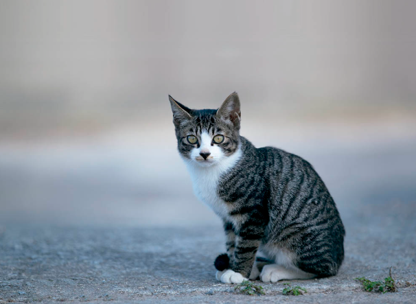

# hello-world
it 테스터 과정

markdown language - 글 서식 편집용 언어

# 반려동물
## 고양이와 강아지 보여주는 화면입니다.

### 고양이

### 반려동물 시스템 발표자료
[네이버검색](htttps://www.naver.com) 
[동물병원시스템프로젝트](https://github.com/zxcvals-cpu/hello-world/) 

[발표자료](/강아지고양이.pptx) 

### 시스템 시연영상

<iframe width="1920" height="1080" src="https://www.youtube.com/embed/G0MNXtmXVcY?list=RDG0MNXtmXVcY" title="[최신가요 실시간 인기차트] 2025년 10월 18일 3주차, 멜론차트 X, 차트둥이 공식채널, 노래모음 KPOP 플레이리스트 종합차트" frameborder="0" allow="accelerometer; autoplay; clipboard-write; encrypted-media; gyroscope; picture-in-picture; web-share" referrerpolicy="strict-origin-when-cross-origin" allowfullscreen></iframe> 

[글씨](주소) 
[글씨](파일) 

> 들여쓰기
> > 들여쓰기
> > > 들여쓰기

1. 첫번째 메뉴
2. 두번째 메뉴
3. 세번째 메뉴

안녕하세요.
* 홍길동 입니다
